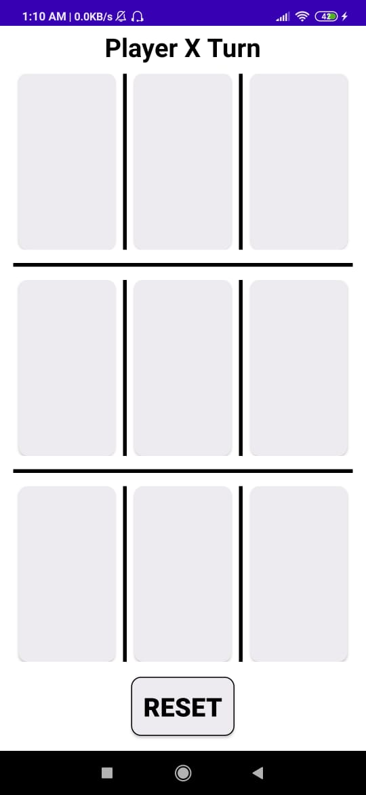
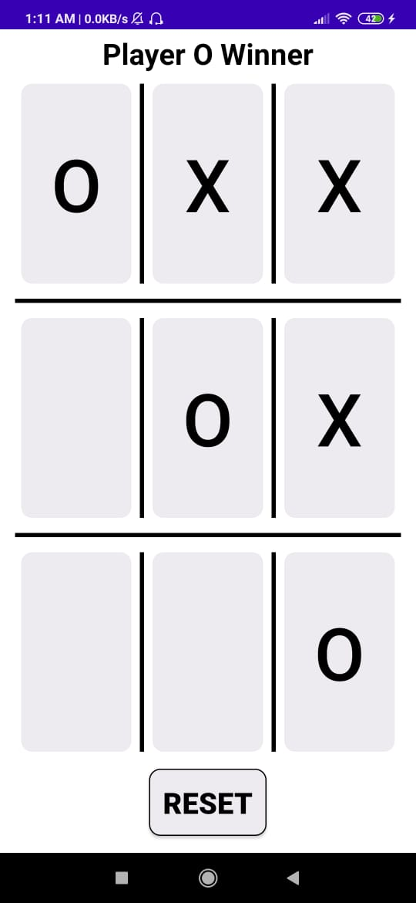
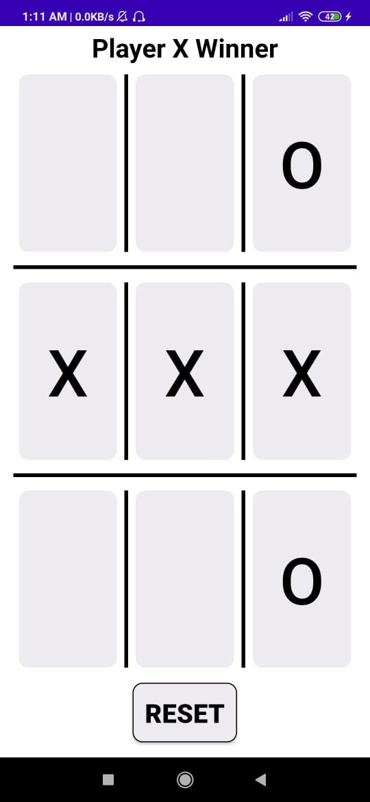
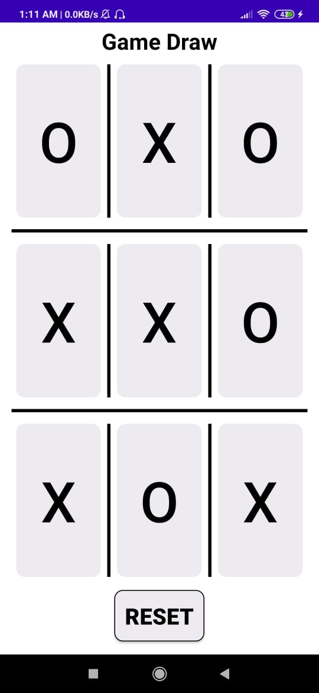

<h1 align="center"> Tic-Tac-Toe-Game </h1>

Tic-Tac-Toe is a paper-and-pencil game for two players, X and O, who take turns marking the spaces in a 3 × 3 grid. The player who succeeds in placing three of their marks in a diagonal, horizontal, or vertical row is the winner. It is a solved game with a forced draw assuming best play from both players. This project is made using **Kotlin**.

<h2 align="center"> Some glimpses of the application </h2>

  

 
 

  

